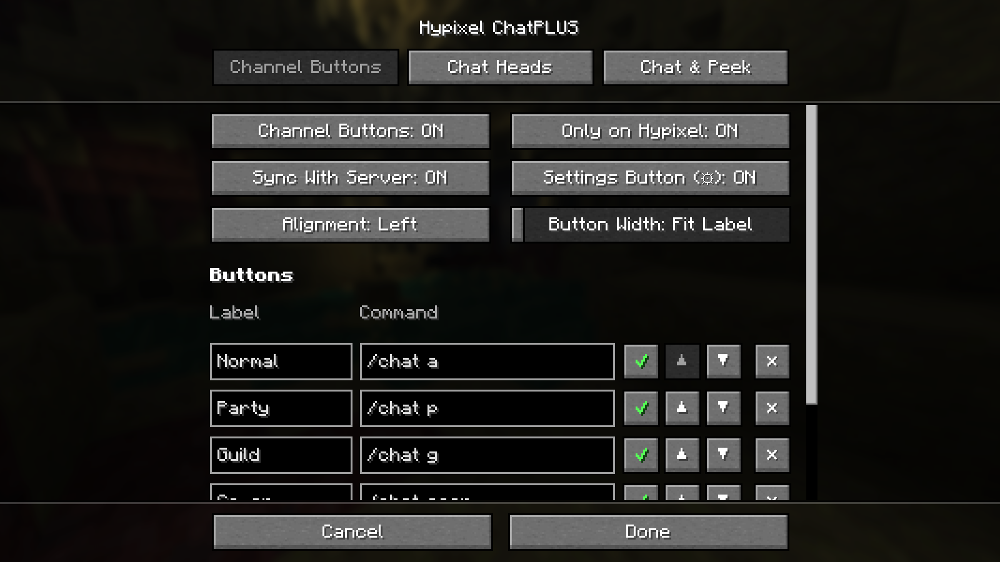
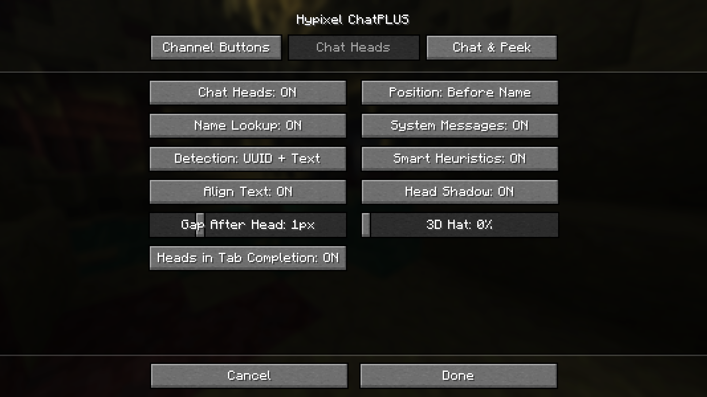

# Ayarlar rehberi

[English](settings.md)

Bu sayfada Hypixel ChatPLUS'ın bütün ayarları, ne işe yaradıkları ve varsayılan değerleri anlatılıyor.

- [Kurulum](#kurulum)
- [Ayarları açmak](#ayarları-açmak)
- [Kanal Butonları sekmesi](#kanal-butonları-sekmesi)
- [Chat Kafaları sekmesi](#chat-kafaları-sekmesi)
- [Chat & Göz Atma sekmesi](#chat--göz-atma-sekmesi)
- [Tuşlar ve komutlar](#tuşlar-ve-komutlar)
- [Ayar dosyası](#ayar-dosyası)
- [Sık sorulanlar](#sık-sorulanlar)

## Kurulum

Minecraft **26.2** için [Fabric Loader](https://fabricmc.net/use/) kur, sonra `mods` klasörüne şunları koy:

| Mod | |
|---|---|
| [Fabric API](https://modrinth.com/mod/fabric-api) | zorunlu |
| [Fabric Language Kotlin](https://modrinth.com/mod/fabric-language-kotlin) | zorunlu |
| [Mod Menu](https://modrinth.com/mod/modmenu) | isteğe bağlı, mod listesine ayar butonu ekler |
| Hypixel ChatPLUS | bu mod |

Chat Heads modunu birlikte kullanma. İkisi de chat'e kafa ekler.

## Ayarları açmak

Şunlardan biri:

- Hypixel'de chat açıkken kanal butonlarının sonundaki **⚙** butonu.
- `/chatplus` komutu.
- Mod Menu kuruluysa **Mod Menu** → Hypixel ChatPLUS → ayar butonu.
- **Ayarları Aç** tuşu. Varsayılan tuşu yok, Kontroller → Tuş Atamaları → Hypixel ChatPLUS altından atanır.

Ekran ayarların bir kopyası üzerinde çalışır. **Bitti** değişiklikleri kaydeder, **İptal** hepsini geri alır.

## Kanal Butonları sekmesi

| Ayar | Varsayılan | Ne yapar |
|---|---|---|
| Kanal Butonları | AÇIK | Chat yazma kutusunun üstündeki buton sırasını gösterir. |
| Sadece Hypixel'de | AÇIK | Başka sunucularda ve tek oyunculuda butonları gizler. |
| Sunucuyla Eşitle | AÇIK | Hypixel hangi kanalda olduğunu söylüyorsa o kanalın butonunu vurgular (aşağıya bak). Kapalıyken vurgu sadece senin tıklamalarınla değişir. |
| Ayar Butonu (⚙) | AÇIK | Kanal butonlarının sonuna ayarları açan küçük bir buton koyar. |
| Hizalama | Sol | Buton sırasını ekranın soluna veya sağına koyar. |
| Buton Genişliği | Yazıya Göre | **Yazıya Göre**: her buton yazısı kadar genişler. Diğer değerlerde (2–120) bütün butonlar aynı genişlikte olur (GUI pikseli). |

### Butonlar

Her satır bir butondur:

| Alan | Anlamı |
|---|---|
| **Yazı** | Butonun üstündeki yazı. `&` renk kodları kullanılabilir, örneğin `&aG` yeşil bir "G" yapar. Tek harf de olabilir. |
| **Komut** | Butonun çalıştırdığı şey. `/` ile başlıyorsa komut olarak, başlamıyorsa chat mesajı olarak gönderilir. |
| ✔ / ✖ | Butonu silmeden gösterir veya gizler. |
| ▲ / ▼ | Butonu sırada sola veya sağa taşır. |
| ✕ | Butonu siler. |

**+ Buton Ekle** yeni satır ekler. **Butonları Sıfırla** varsayılan butonlara döner.

Varsayılan butonlar:

| Yazı | Komut | Görünür |
|---|---|---|
| Normal | `/chat a` | evet |
| Party | `/chat p` | evet |
| Guild | `/chat g` | evet |
| Co-op | `/chat coop` | evet |
| Officer | `/chat o` | hayır |

#### Kanal butonu ve komut butonu

Komutu Hypixel kanal değiştirme komutu olan buton **kanal butonu** olur ve o kanaldayken vurgulanır.
Tanınan komutlar (büyük/küçük harf fark etmez):

| Kanal | Komutlar |
|---|---|
| ALL (Normal) | `/chat a`, `/chat all` |
| PARTY | `/chat p`, `/chat party` |
| GUILD | `/chat g`, `/chat guild` |
| OFFICER | `/chat o`, `/chat officer` |
| SKYBLOCK CO-OP | `/chat coop`, `/chat co-op`, `/chat skyblock-coop` |

Başka bir komut verilirse buton **komut butonu** olur: tıklayınca komutu çalıştırır, hiç vurgulanmaz. Örnekler:

| Yazı | Komut |
|---|---|
| Warp | `/p warp` |
| Ada | `/is` |
| Hub | `/hub` |
| Dungeon | `/warp dungeon_hub` |
| PL | `/pl` |

#### Sunucuyla eşitleme

**Sunucuyla Eşitle** açıkken vurgu şu Hypixel mesajlarına göre güncellenir:

- "You are now in the PARTY channel". Kanalı `/chat` yazarak değiştirdiğinde de çalışır.
- "You are not in a party and were moved to the ALL channel." ve ALL kanalına geri atıldığını söyleyen diğer mesajlar.
- "Opened a chat conversation with ..." (`/chat <oyuncu>`). Bu durumda hiçbir buton vurgulanmaz.

Hypixel bu mesajları `/language` ayarındaki dile çevirir. İngilizce ve Türkçe kanal isimleri tanınır.

Komut yazarken (yazı `/` ile başlıyorsa) butonlar gizlenir, çünkü Minecraft komut önerilerini aynı yerde gösterir.

## Chat Kafaları sekmesi

| Ayar | Varsayılan | Ne yapar |
|---|---|---|
| Chat Kafaları | AÇIK | Chat'teki oyuncu kafalarını açar veya kapatır. |
| Konum | İsmin Önünde | **İsmin Önünde**: kafa oyuncunun hemen önüne, rütbenin önüne gelir: `Guild > 🙂[MVP+] İsim: selam`. **Satır Başında**: satırın en başına gelir: `🙂Guild > [MVP+] İsim: selam`. |
| İsimle Bul | AÇIK | Lobinde olmayan oyuncuların (guild, parti, co-op, özel mesaj, SkyBlock chat) skinini isimden bulur. Kapalıyken bu mesajlarda kafa çıkmaz. |
| Sistem Mesajları | AÇIK | Sunucunun sistem mesajı olarak gönderdiği satırlara da kafa ekler. **Hypixel bütün chati bu şekilde gönderir, açık bırak.** |
| Tespit | UUID + Metin | Gönderen nasıl bulunacak. **UUID**: sunucu mesajı kimin gönderdiğini bildirir (vanilla chat). **Metin**: gönderen mesajın yazısından okunur (Hypixel). *Sadece UUID* ve *Sadece Metin* tek yöntemle sınırlar. |
| Akıllı Tahmin | AÇIK | Göndereni bildiren sunucularda yazıdan tahmin etmeyi bırakır. Hypixel'de bir etkisi yoktur. |
| Yazıyı Hizala | AÇIK | Sadece **Satır Başında** modunda: kafası olmayan satırları sağa kaydırır, bütün yazılar aynı yerden başlar. |
| Kafa Gölgesi | AÇIK | Kafanın altına, yazı gölgesi gibi bir gölge çizer. |
| Kafadan Sonra Boşluk | 1px | Kafa ile yazı arasındaki boşluk. 0 = yapışık, 1 = yazı gölgesiyle aynı. |
| 3D Şapka | %0 | Şapka katmanını (skinin ikinci katmanı) yüzden biraz büyük çizer, kafalar daha az düz görünür. |
| Tab Tamamlamada Kafa | AÇIK | Komut önerilerinde (Tab) oyuncu isimlerinin yanına kafa koyar. |

### Oyuncu nasıl bulunuyor

1. **Hypixel formatları.** Hypixel'de her satırın başı bilinen formatlarla karşılaştırılır: guild, officer, parti,
   co-op, özel mesaj, Party Finder; seviye, rütbe ve emblem içeren SkyBlock ve lobi chati; giriş/çıkış satırları.
   `Parti >` gibi çevrilmiş önekler de tanınır.
2. **Tab listesi.** Oyuncu lobindeyse kafa, sunucunun gönderdiği skinin aynısını kullanır (nick'li oyuncular dahil).
3. **İsimle bulma.** Değilse skin isimden bulunur. Skin yüklenene kadar oyun bir anlığına varsayılan Steve/Alex
   kafasını gösterir. Sonuçlar oyun kapansa bile önbellekte kalır (`usercache.json`).
4. **Yedek yöntem.** Diğer mesajlarda ("İsim was killed by İsim2" gibi) satırda geçen ilk tab listesi ismine kafa
   konur. Chat Heads da böyle çalışır.

NPC ve boss satırlarına (`[NPC]`, `[BOSS]`, `[STATUE]`, ...) kafa konmaz.

## Chat & Göz Atma sekmesi

| Ayar | Varsayılan | Ne yapar |
|---|---|---|
| Tutulan Mesaj | 1000 | Chat'te ne kadar geriye kaydırabileceğin (100–10000). Vanilla 100 tutar. |
| Gönderilen Geçmişi | 500 | ↑ tuşunun hatırladığı kendi mesaj ve komut sayın (100–10000). Vanilla 100 tutar. |
| Çıkınca Chat Silinmesin | KAPALI | Sunucudan çıkınca chat temizlenmez, sonra girdiğin sunucuda eski mesajları okuyabilirsin. |
| Chat'e Göz Atma | AÇIK | Göz atma tuşunu açar veya kapatır. |
| Tuş Modu | Basılı Tut | **Basılı Tut**: tuş basılıyken chat görünür. **Aç/Kapa**: bir basış açar, ikinci basış kapatır. |
| Tam Yükseklik | AÇIK | Göz atarken açık chat'in daha uzun yüksekliğini kullanır. |
| Tekerlekle Kaydır | AÇIK | Göz atarken fare tekerleği hotbar yerine chati kaydırır. Tek satır kaydırmak için Shift'e bas. |
| Göz Atma Tuşu | Sol Alt | Tuşu değiştirmek için Minecraft'ın Kontroller ekranını açar. |

### Chat'e göz atma ne yapar

Oyun oynarken eski chat mesajları birkaç saniye sonra kaybolur. Chat'i açınca geri gelirler, ama yazma kutusu
açılır, fare serbest kalır ve hareket edemezsin.

Göz atma, chat'i açıkken nasıl görünüyorsa öyle gösterir: bütün satırlar tam görünür, ama yazma kutusu **açılmaz**.
Yürümeye, savaşmaya, etrafa bakmaya devam edersin. Tuşu bırakınca (aç/kapa modunda tekrar basınca) chat normale
döner ve en yeni mesaja kayar.

## Tuşlar ve komutlar

**Kontroller → Tuş Atamaları → Hypixel ChatPLUS** altında:

| Tuş | Varsayılan |
|---|---|
| Chat'e Göz At | Sol Alt |
| Ayarları Aç | atanmamış |

| Komut | |
|---|---|
| `/chatplus` | ayarları açar |

## Ayar dosyası

Ayarlar `.minecraft/config/hypixel-chatplus.json` dosyasında durur. Elle düzenleyebilir veya arkadaşına
gönderebilirsin. Dosyayı silersen ayarlar varsayılana döner. Sınır dışındaki değerler yüklenirken düzeltilir.
Dosyanın tam hali için [İngilizce rehberdeki örneğe](settings.md#config-file) bak.

## Sık sorulanlar

**Kafa bir saniye Steve/Alex görünüyor, sonra gerçek skin geliyor.**
Skin indiriliyor. Bir kere indikten sonra önbellekten gelir.

**Bir oyuncu hep varsayılan kafayla görünüyor.**
Chat'teki isim gerçek bir Minecraft hesabı değil (örneğin oyun içindeki bir nick) ya da skin sunucularına
ulaşılamadı. Lobindeki oyuncular her zaman tab listesindeki skinle görünür.

**Kanal butonlarını göremiyorum.**
Varsayılan olarak sadece Hypixel'de görünürler (**Sadece Hypixel'de**). `/` ile başlayan bir komut yazarken de gizlenirler.

**Yanlış buton vurgulanıyor.**
**Sunucuyla Eşitle**'yi aç. Hypixel'i kanal isimleri tanınmayan bir dilde kullanıyorsan vurgu sadece tıklamalarını
takip eder. Mesajın tam halini yazıp bir issue açarsan eklenir.

**Chat Heads ile birlikte kullanabilir miyim?**
Hayır. İkisi de kafa ekler, Chat Heads'i kaldır. Bu mod onun özelliklerini içeriyor.

**Başka sunucularda çalışır mı?**
Chat kafaları, chat geçmişi ve göz atma her yerde çalışır. Kanal butonları Hypixel'in `/chat` komutu için yapıldı,
ama **Sadece Hypixel'de**'yi kapatıp her sunucuda komut butonu olarak kullanabilirsin.
